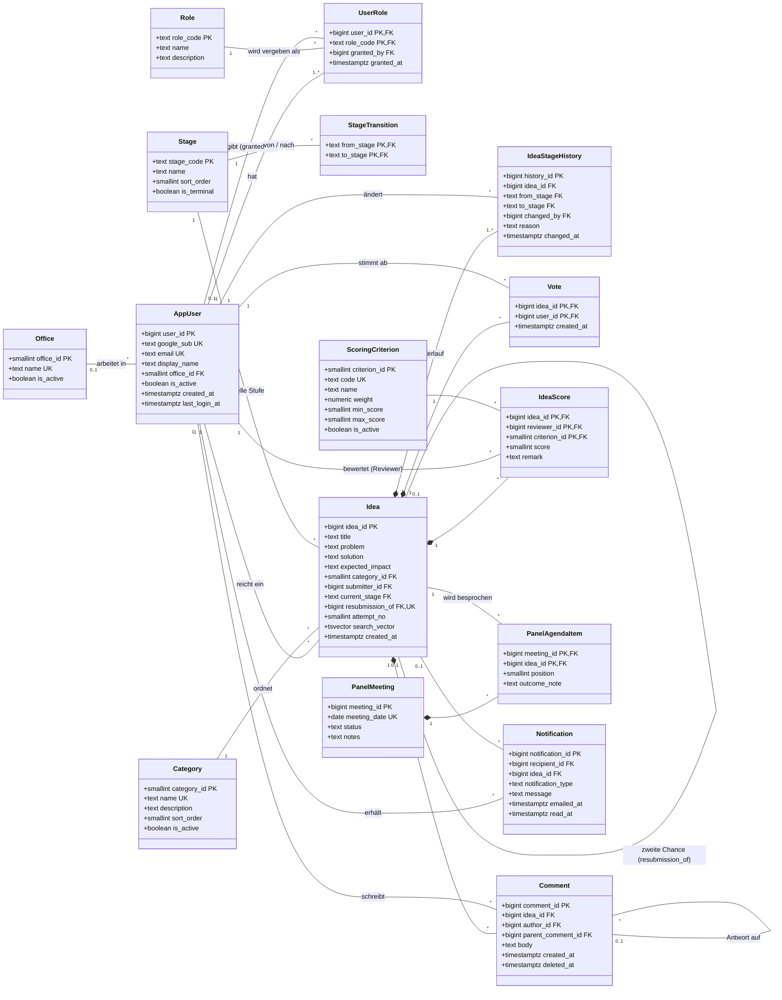
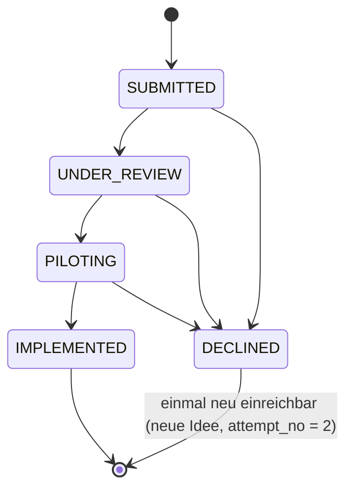

# IdeaForge – Datenmodell (UML)

Relationales Modell für PostgreSQL mit integrierter Benutzer- und Rollenverwaltung.
Das zugehörige DDL steht in `ideaforge_schema.sql`, die Regeltests in `ideaforge_tests.sql`.

## Klassendiagramm

## Rollenkonzept

| Aktion | STAFF | REVIEWER | ADMIN |
|---|:-:|:-:|:-:|
| Idee einreichen, suchen, abstimmen, kommentieren | ✓ | ✓ | ✓ |
| Idee bewerten (nicht eigene) | – | ✓ | – |
| Idee zwischen Stufen verschieben | – | ✓ | – |
| Kategorien verwalten, Kategorie einer Idee ändern | – | – | ✓ |
| Reviewer ernennen / entziehen | – | – | ✓ |
| Reports / Dashboard | ✓ | ✓ | ✓ |

- Jeder neue Benutzer bekommt automatisch `STAFF` (Trigger).
- `REVIEWER` und `ADMIN` schließen sich gegenseitig aus, denn Admins dürfen weder bewerten noch verschieben.
- Der allererste Admin wird ohne `granted_by` angelegt (Bootstrap), danach vergeben nur Admins Rollen.
- Login über Google: `google_sub` ist der stabile Schlüssel aus dem Google-ID-Token; die E-Mail kann sich ändern.

## Pipeline

- Ein Stufenwechsel ist ausschließlich ein `INSERT` in `idea_stage_history` (mit Pflicht-Begründung). Ein Trigger prüft Übergang und Reviewer-Rolle, setzt `idea.current_stage` und erzeugt die Benachrichtigung für die einreichende Person. Ein direktes `UPDATE` der Stufe wird abgewiesen.
- Die zweite Chance ist eine neue Zeile in `idea` mit `resubmission_of` → abgelehnte Originalidee. `UNIQUE(resubmission_of)` und `attempt_no ∈ {1,2}` verhindern eine dritte Runde. So bleibt die Bewertungs- und Abstimmungshistorie der ersten Runde erhalten.

## Abdeckung der Anforderungen

| Anforderung | Umsetzung |
|---|---|
| Idee mit Titel, Problem, Lösung, Kategorie, Impact | `idea` |
| 4 Kategorien | `category` (Stammdaten, vom Admin erweiterbar) |
| Suchen | `idea.search_vector` + GIN-Index (Volltext) |
| Eine Stimme pro Person und Idee | PK `vote(idea_id, user_id)` |
| Stufen, kein Überspringen, Ablehnung jederzeit | `stage`, `stage_transition`, Trigger |
| Begründung für Einreichende sichtbar | `idea_stage_history.reason` |
| Zweite Chance | `idea.resubmission_of`, `attempt_no` |
| Keine Bewertung eigener Ideen, Admins bewerten nicht | Trigger auf `idea_score` |
| Bewertungskriterien | `scoring_criterion` (gewichtet), `idea_score` |
| Panel am ersten Dienstag | `panel_meeting` mit CHECK, `panel_agenda_item` |
| Dashboard nach Stufe, Kategorie, Office | `v_pipeline_dashboard` (GROUPING SETS) |
| Benachrichtigung bei Stufenwechsel | `notification` (per Trigger befüllt) |
| Kommentare | `comment` (mit Antworten, Soft-Delete) |
| Duplikate beim Einreichen erkennen | Volltextsuche in derselben Kategorie |
| Leaderboard dieses Quartal | `v_leaderboard_current_quarter` |
| Ready-for-panel-Liste | `v_ready_for_panel` |
