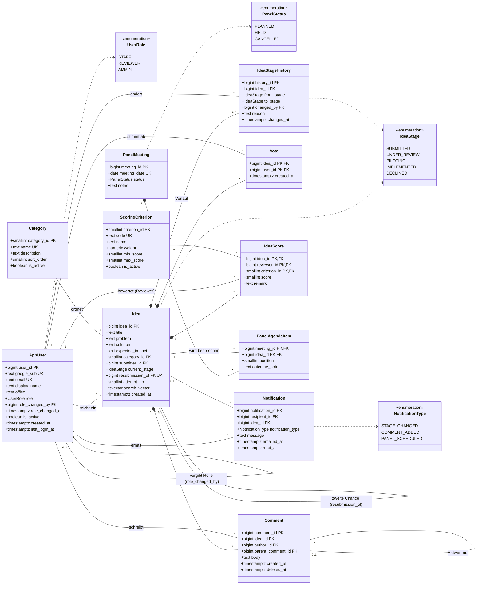
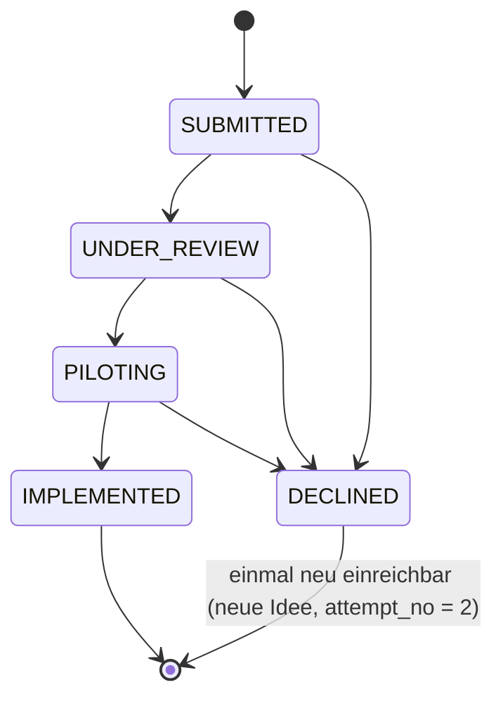

# IdeaForge – Datenmodell (UML), Version 2

Relationales Modell für PostgreSQL mit integrierter Benutzer- und Rollenverwaltung.
Version 2 kommt ohne Stammdaten-Tabellen für Rolle, Stufe und Office aus.

> **Note (2026-10-10, implementation of US-1):** the `idea` table in `build/supabase/migrations/20261010192020_idea.sql` extends this model with `office` (copy of the submitter's office at submit time) and `is_confidential` (visible only to the submitter and the reviewers). `search_vector` is not created yet; it follows with the dashboard search (US-2). `attempt_no` is dropped (decided 2026-10-10): it can be derived from `resubmission_of` (NULL = first attempt, set = second attempt). A trigger rejects resubmitting a second attempt, so `UNIQUE(resubmission_of)` plus this check still prevent a third round; `idea.max_attempts` in `ideaforge.properties` is only a UI text.

| Datei | Inhalt |
|---|---|
| `ideaforge_schema.sql` | DDL (11 Tabellen, 4 ENUM-Typen, 4 Sichten) |
| `ideaforge.properties` | Anzeigenamen, Rechte je Rolle, Stufenfarben, Office-Liste |
| `ideaforge_tests.sql` | 28 Regeltests (laufen in einer Transaktion, Rollback am Ende) |

## Was aus den kleinen Tabellen geworden ist

| Vorher (V1) | Jetzt (V2) | Warum so |
|---|---|---|
| `role`, `user_role` | Spalte `app_user.role` vom Typ `ENUM user_role` + `role_changed_by`, `role_changed_at` | Jeder Benutzer hat genau eine Rolle (Admin und Reviewer schließen sich ohnehin aus). Die DB kennt die Werte weiterhin und prüft damit Bewerten und Verschieben. |
| `stage` | `ENUM idea_stage` | Feste fachliche Werte, die Reihenfolge des ENUMs ist die Pipeline-Reihenfolge. |
| `stage_transition` | Funktion `is_valid_transition(from, to)` | Sechs feste Übergänge, als Code lesbarer als als Daten. |
| `office` | Spalte `app_user.office` (Text-Code, Formatprüfung per CHECK), Liste in `ideaforge.properties` | Reine Gruppierung fürs Dashboard; neue Offices ohne DB-Änderung. |
| CHECK-Listen für Panel-Status und Benachrichtigungstyp | `ENUM panel_status`, `ENUM notification_type` | Einheitlich mit den anderen festen Werten. |

**Bleiben Tabellen:** `category` und `scoring_criterion`. Kategorien pflegt der Admin laut Anforderung zur Laufzeit, und beide werden per Fremdschlüssel von Ideen bzw. Bewertungen referenziert. In einer Properties-Datei würde jede Änderung ein Deployment brauchen, und umbenannte Einträge würden alte Daten verwaisen lassen.

**Arbeitsteilung DB ↔ Properties:** Die *Codes* (`REVIEWER`, `PILOTING`, `BERLIN`) sind der Vertrag zwischen beiden. Die Datenbank kennt nur die Codes und setzt die Regeln durch. Die Properties-Datei liefert alles, was nur angezeigt wird: Labels, Beschreibungen, Farben, Rechte für das UI, die Office-Liste. Ein neuer Wert für Rolle oder Stufe braucht deshalb beides: `ALTER TYPE … ADD VALUE` und einen Eintrag in der Properties-Datei.

## Klassendiagramm

## Rollenkonzept

| Aktion | STAFF | REVIEWER | ADMIN |
|---|:-:|:-:|:-:|
| Idee einreichen, suchen, abstimmen, kommentieren | ✓ | ✓ | ✓ |
| Idee bewerten (nicht eigene) | – | ✓ | – |
| Idee zwischen Stufen verschieben | – | ✓ | – |
| Kategorien verwalten, Kategorie einer Idee ändern | – | – | ✓ |
| Reviewer ernennen / entziehen | – | – | ✓ |
| Reports / Dashboard | ✓ | ✓ | ✓ |

- Neue Benutzer sind `STAFF` (Default der Spalte). Ein Insert direkt als Reviewer oder Admin wird abgewiesen.
- Rollenänderungen nur mit `role_changed_by` = aktiver Admin; `role_changed_at` setzt der Trigger.
- Bootstrap: Der allererste Admin darf ohne `role_changed_by` gesetzt werden.
- Der letzte aktive Admin kann weder herabgestuft noch deaktiviert werden.
- Die Rechte je Rolle für das UI stehen in `ideaforge.properties` (`role.<CODE>.permissions`). Verbindlich für Bewerten und Verschieben bleiben die Trigger in der DB.
- Login über Google: `google_sub` ist der stabile Schlüssel aus dem Google-ID-Token; die E-Mail kann sich ändern.

**Verlust gegenüber V1:** Es gibt keine Historie der Rollenvergaben mehr, nur noch die letzte Änderung (wer, wann). Falls ein Audit-Trail nötig wird, reicht eine kleine Tabelle `role_change_log`, die per Trigger befüllt wird.

## Pipeline

- Ein Stufenwechsel ist ausschließlich ein `INSERT` in `idea_stage_history` (mit Pflicht-Begründung). Ein Trigger prüft den Übergang über `is_valid_transition()` und die Reviewer-Rolle, setzt `idea.current_stage` und erzeugt die Benachrichtigung für die einreichende Person. Ein direktes `UPDATE` der Stufe wird abgewiesen.
- Die zweite Chance ist eine neue Zeile in `idea` mit `resubmission_of` → abgelehnte Originalidee. `UNIQUE(resubmission_of)` und `attempt_no ∈ {1,2}` verhindern eine dritte Runde.

## Abdeckung der Anforderungen

| Anforderung | Umsetzung |
|---|---|
| Idee mit Titel, Problem, Lösung, Kategorie, Impact | `idea` |
| 4 Kategorien | `category` (Startdaten, vom Admin erweiterbar) |
| Suchen | `idea.search_vector` + GIN-Index (Volltext) |
| Eine Stimme pro Person und Idee | PK `vote(idea_id, user_id)` |
| Stufen, kein Überspringen, Ablehnung jederzeit | `ENUM idea_stage`, `is_valid_transition()`, Trigger |
| Begründung für Einreichende sichtbar | `idea_stage_history.reason` |
| Zweite Chance | `idea.resubmission_of`, `attempt_no` |
| Keine Bewertung eigener Ideen, Admins bewerten nicht | Trigger auf `idea_score` |
| Bewertungskriterien | `scoring_criterion` (gewichtet), `idea_score` |
| Panel am ersten Dienstag | `panel_meeting` mit CHECK, `panel_agenda_item` |
| Dashboard nach Stufe, Kategorie, Office | `v_pipeline_dashboard` (GROUPING SETS), Labels aus Properties |
| Benachrichtigung bei Stufenwechsel | `notification` (per Trigger befüllt) |
| Kommentare | `comment` (mit Antworten, Soft-Delete) |
| Duplikate beim Einreichen erkennen | Volltextsuche in derselben Kategorie |
| Leaderboard dieses Quartal | `v_leaderboard_current_quarter` |
| Ready-for-panel-Liste | `v_ready_for_panel` |
