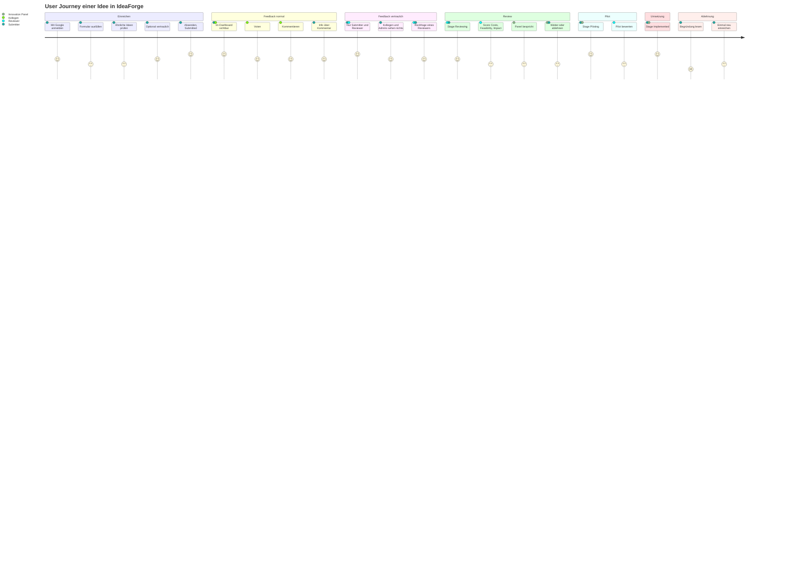
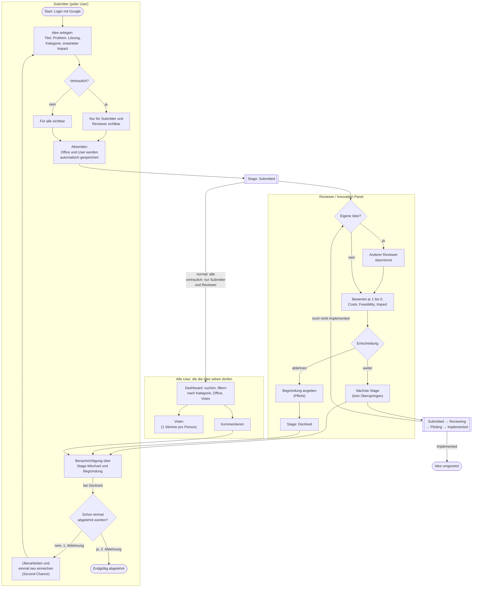
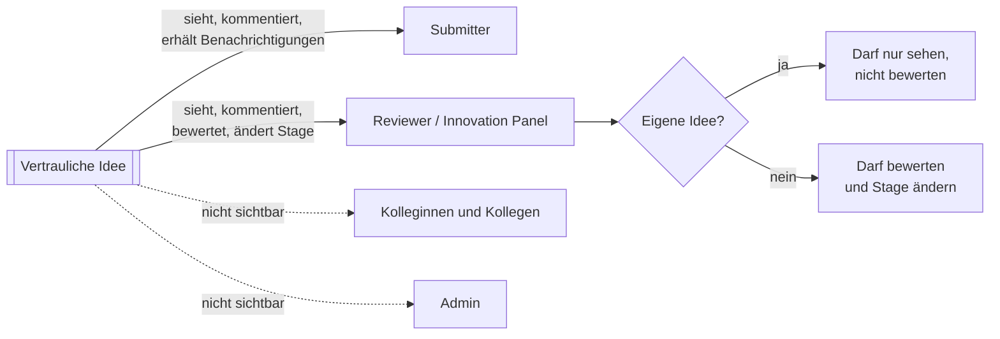
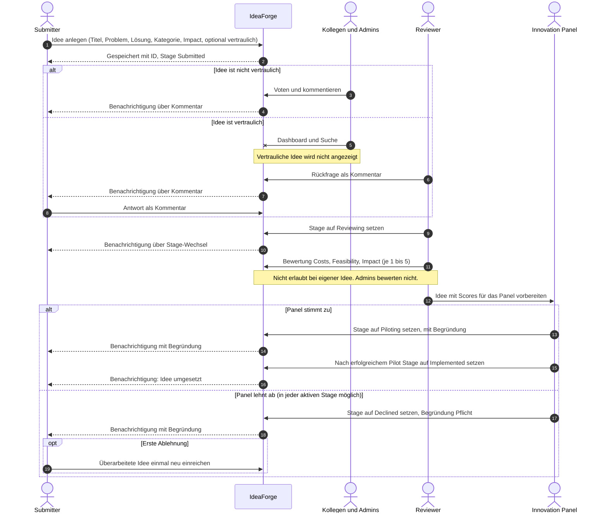
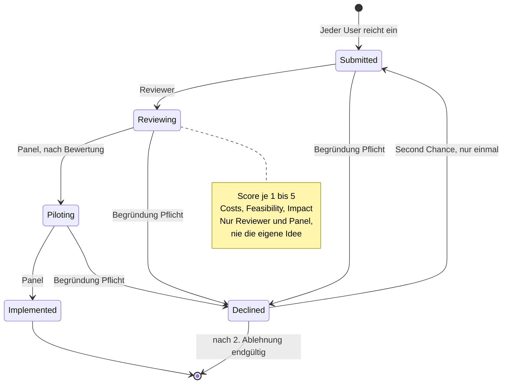

# IdeaForge: User Journey einer Idee

Die Reise einer Idee von der Einreichung bis zur Umsetzung oder Ablehnung, für normale und für **vertrauliche** Ideen.
Quellen: `requirements/requirements.md`, `requirements/UserStories/1–10`, `CLAUDE.md`, `design/DatenModel/V2-StammdatenIntegriert/ideaforge_datenmodell.md` sowie Vorgaben aus dem Chat vom 2026-10-08.

## 1. Rollen & Rechte

| Aktion | Staff | Reviewer / Innovation Panel | Admin |
|---|---|---|---|
| Idee einreichen | ✅ | ✅ | ✅ |
| Dashboard ansehen, suchen, filtern | ✅ | ✅ | ✅ |
| Vertrauliche Ideen sehen | nur eigene | ✅ | nur eigene |
| Voten (1 Stimme pro Person und Idee) | ✅ | ✅ | ✅ |
| Kommentieren | ✅ | ✅ | ✅ |
| Idee bewerten (Score 1–5) | ❌ | ✅, aber **nie die eigene Idee** | ❌ |
| Stage ändern / ablehnen | ❌ | ✅, aber **nie die eigene Idee** | ❌ |
| User und Kategorien verwalten | ❌ | ❌ | ✅ |

## 2. Normale und vertrauliche Idee im Vergleich

Regel aus `CLAUDE.md` und US-1: Vertrauliche Ideen sind **nur für den Submitter und die Reviewer (Innovation Panel)** sichtbar. Ablauf, Stages, Bewertung, Ablehnung und Second Chance sind identisch, nur die Sichtbarkeit unterscheidet sich.

| Schritt | Normale Idee | Vertrauliche Idee |
|---|---|---|
| Sichtbarkeit | alle User | nur Submitter und Reviewer; **nicht** Kolleg:innen, **nicht** Admins |
| Dashboard / Suche | für alle auffindbar | nur in der Ansicht von Submitter und Reviewern |
| Voten | alle User | nur wer die Idee sieht (Submitter, Reviewer) |
| Kommentare | alle User | nur Submitter und Reviewer |
| Bewerten / Stage ändern | Reviewer, nie die eigene Idee | gleich |
| Benachrichtigungen | an den Submitter | gleich |
| Stages, Ablehnung, Second Chance | Submitted → Reviewing → Piloting → Implemented, Declined | gleich |

## 3. User Journey

Die Werte zeigen die Zufriedenheit je Schritt: 1 = frustriert, 5 = begeistert. Die Beschriftungen sind bewusst kurz, weil Mermaid lange Texte in diesem Diagrammtyp abschneidet.

Je nach Markierung durchläuft eine Idee **entweder** „Feedback normal“ **oder** „Feedback vertraulich“.

## 4. Ablauf mit Entscheidungen

Hinweis: Admins reichen wie alle anderen Ideen ein, bewerten aber nicht und verschieben keine Stages.

## 5. Sichtbarkeit einer vertraulichen Idee

## 6. Sequenz: wer macht was?

## 7. Stage-Modell

Regeln, gültig für normale und vertrauliche Ideen:
- Keine Stage darf übersprungen werden.
- Ablehnen geht aus jeder aktiven Stage.
- Nur Reviewer bzw. das Innovation Panel ändern Stages.
- Der Submitter sieht bei jedem Wechsel die Begründung.

## 8. Offene Punkte

### Abweichungen zu bestehenden Dokumenten

| # | Thema | Diese User Journey | Bestehende Dokumente | Zu klären |
|---|---|---|---|---|
| 1 | Name der 2. Stage | **Reviewing** | „Under Review“ (requirements.md, US-3), `UNDER_REVIEW` (Datenmodell V2) | Einheitlichen Namen festlegen und Dokumente angleichen |
| 2 | Score-Skala | **1–5** | 0–5 (requirements.md, US-3) | Skala festlegen, `scoring_criterion.min_score` anpassen |
| 3 | Bedeutung Cost-Score | – | „cost 5 means least costs“ (requirements.md) | Bestätigen: 5 = geringste Kosten, damit gilt überall „höher = besser“ |
| 4 | Begründung | Pflicht bei Ablehnung | US-3: Begründung mit Scores bei **jedem** Stage-Wechsel; Datenmodell: `reason` immer Pflicht | Pflicht nur bei Ablehnung oder bei jedem Wechsel? |
| 5 | Second Chance | Abgelehnte Idee einmal neu einreichen | Datenmodell: als **neue** Idee mit `attempt_no = 2` | Diagramm vereinfacht das als Rückkehr zu Submitted |

### Vertrauliche Ideen (nicht in den Requirements geregelt)

| # | Frage | Warum relevant |
|---|---|---|
| 6 | Bleibt eine vertrauliche Idee auch nach **Implemented** vertraulich, oder wird sie dann öffentlich? | Umgesetzte Ideen sind oft für alle interessant |
| 7 | Darf der Submitter die Markierung „vertraulich“ später **ändern**? | Nicht in den Requirements geregelt |
| 8 | Übernimmt eine neu eingereichte Idee (Second Chance) die Markierung? | Neue Idee mit `attempt_no = 2` im Datenmodell |
| 9 | Zählen vertrauliche Ideen in den **Dashboard-Statistiken** (nach Stage, Kategorie, Office) mit, z. B. anonym als Anzahl? | US-2 Dashboard für alle User |
| 10 | Dürfen Reviewer vertrauliche Ideen **voten**? | Voting ist sonst ein Signal der Kolleg:innen, das hier fehlt |
