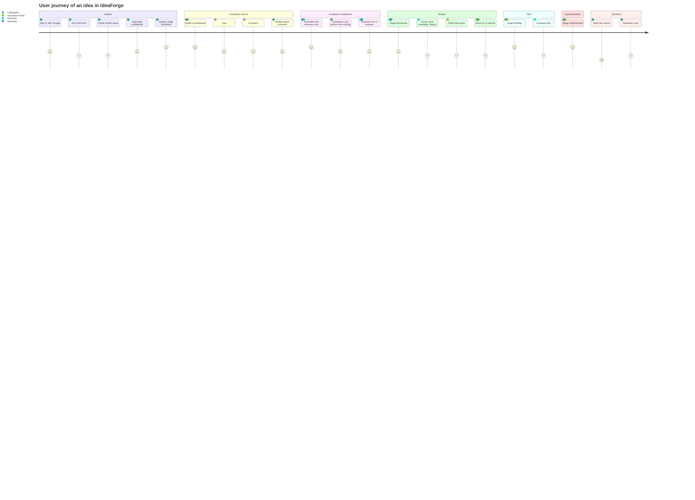
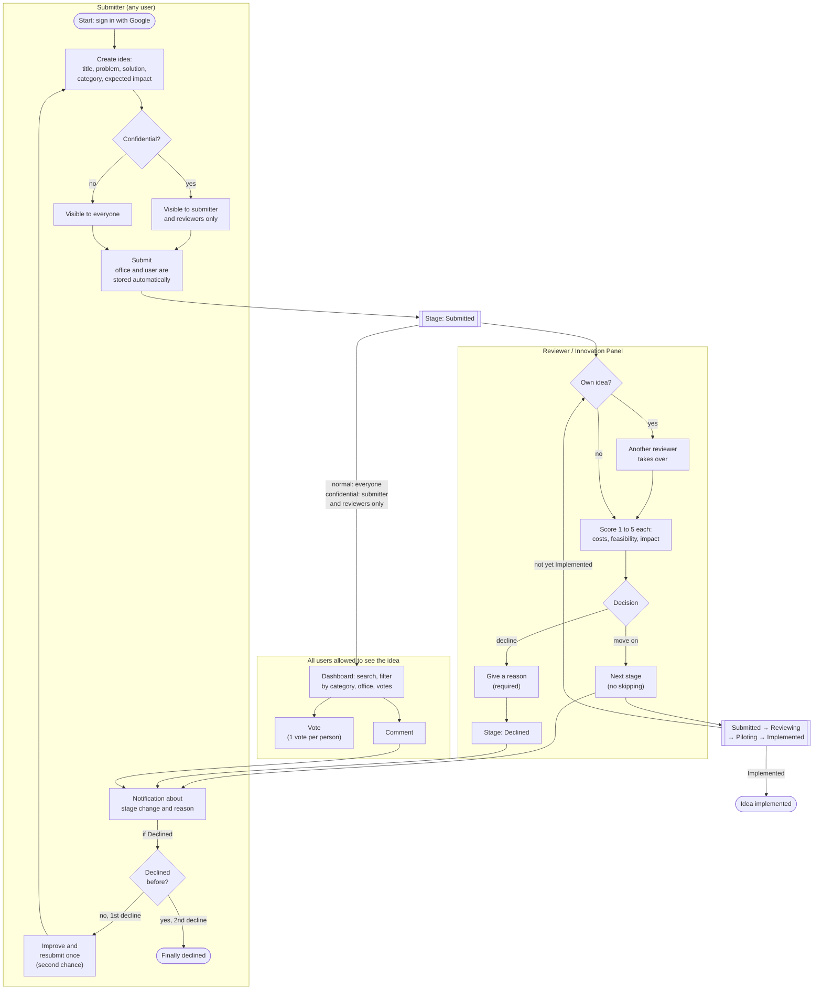
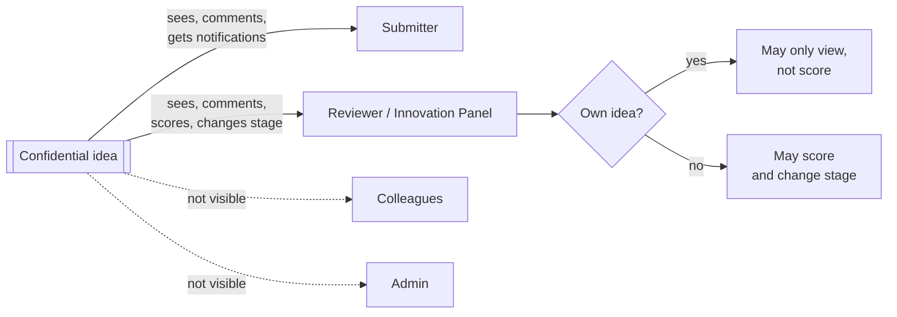
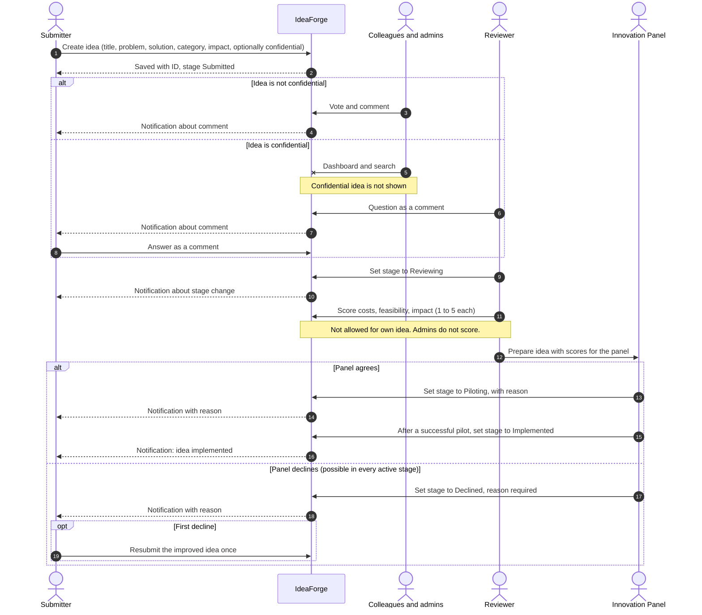
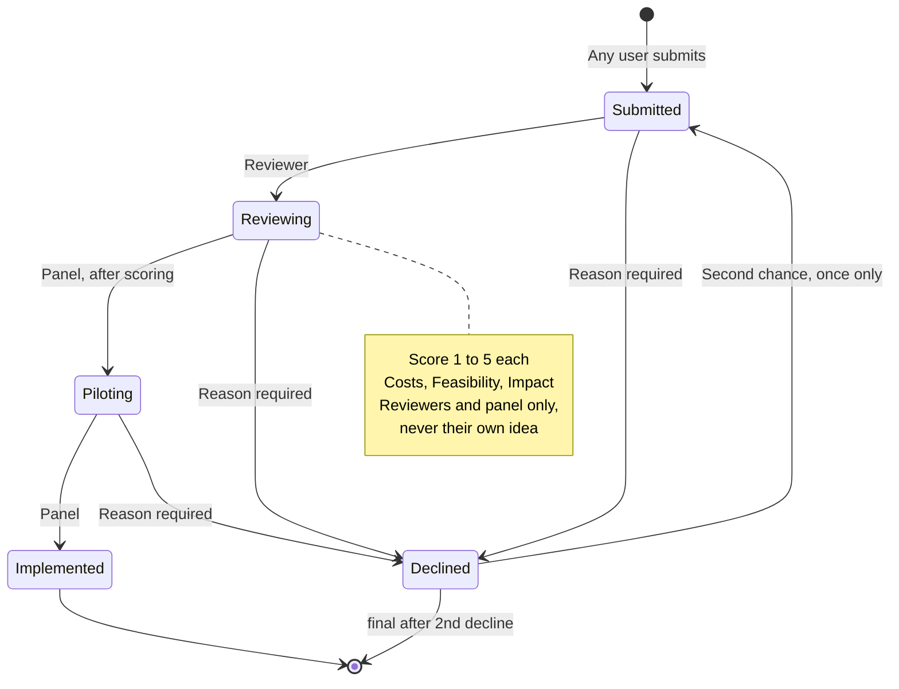

# IdeaForge: User Journey of an Idea

The journey of an idea from submission to implementation or rejection, for normal and for **confidential** ideas.
Sources: `requirements/requirements.md`, `requirements/UserStories/1–10`, `CLAUDE.md`, `design/DatenModel/V2-StammdatenIntegriert/ideaforge_datenmodell.md` and decisions from the chat on 2026-10-08.

## 1. Roles & permissions

| Action | Staff | Reviewer / Innovation Panel | Admin |
|---|---|---|---|
| Submit an idea | ✅ | ✅ | ✅ |
| View, search and filter the dashboard | ✅ | ✅ | ✅ |
| See confidential ideas | own only | ✅ | own only |
| Vote (1 vote per person and idea) | ✅ | ✅ | ✅ |
| Comment | ✅ | ✅ | ✅ |
| Score an idea (1–5) | ❌ | ✅, but **never their own idea** | ❌ |
| Change stage / decline | ❌ | ✅, but **never their own idea** | ❌ |
| Manage users and categories | ❌ | ❌ | ✅ |

## 2. Normal and confidential ideas compared

Rule from `CLAUDE.md` and US-1: confidential ideas are visible **only to the submitter and the reviewers (Innovation Panel)**. Flow, stages, scoring, declining and second chance are identical; only the visibility differs.

| Step | Normal idea | Confidential idea |
|---|---|---|
| Visibility | all users | submitter and reviewers only; **not** colleagues, **not** admins |
| Dashboard / search | findable by everyone | only in the view of the submitter and reviewers |
| Voting | all users | only those who can see the idea (submitter, reviewers) |
| Comments | all users | submitter and reviewers only |
| Scoring / changing stage | reviewers, never their own idea | same |
| Notifications | to the submitter | same |
| Stages, declining, second chance | Submitted → Reviewing → Piloting → Implemented, Declined | same |

## 3. User journey

The values show the satisfaction per step: 1 = frustrated, 5 = delighted. The labels are kept short on purpose, because Mermaid cuts off long texts in this diagram type.

Depending on the flag, an idea goes through **either** "Feedback normal" **or** "Feedback confidential".

## 4. Flow with decisions

Note: admins submit ideas like everyone else, but they do not score ideas or move stages.

## 5. Visibility of a confidential idea

## 6. Sequence: who does what?

## 7. Stage model

Rules for normal and confidential ideas:
- No stage may be skipped.
- An idea can be declined from every active stage.
- Only reviewers or the Innovation Panel change stages.
- The submitter sees the reason for every change.

## 8. Open points

### Differences from existing documents

| # | Topic | This user journey | Existing documents | To clarify |
|---|---|---|---|---|
| 1 | Name of the 2nd stage | **Reviewing** | "Under Review" (requirements.md, US-3), `UNDER_REVIEW` (data model V2) | Agree on one name and align the documents |
| 2 | Score scale | **1–5** | 0–5 (requirements.md, US-3) | Decide the scale, adjust `scoring_criterion.min_score` |
| 3 | Meaning of the cost score | – | "cost 5 means least costs" (requirements.md) | Confirm: 5 = lowest cost, so "higher = better" applies everywhere |
| 4 | Reason | Required when declining | US-3: reason with scores for **every** stage change; data model: `reason` always required | Required only when declining or for every change? |
| 5 | Second chance | Resubmit a declined idea once | Data model: as a **new** idea with `attempt_no = 2` | The diagram simplifies this as a return to Submitted |

### Confidential ideas (not covered by the requirements)

| # | Question | Why it matters |
|---|---|---|
| 6 | Does a confidential idea stay confidential after **Implemented**, or does it become public? | Implemented ideas are often interesting for everyone |
| 7 | May the submitter **change** the confidential flag later? | Not covered by the requirements |
| 8 | Does a resubmitted idea (second chance) keep the flag? | New idea with `attempt_no = 2` in the data model |
| 9 | Do confidential ideas count in the **dashboard statistics** (by stage, category, office), e.g. anonymously as a number? | US-2 dashboard for all users |
| 10 | May reviewers **vote** on confidential ideas? | Otherwise voting is a signal from colleagues, which is missing here |
